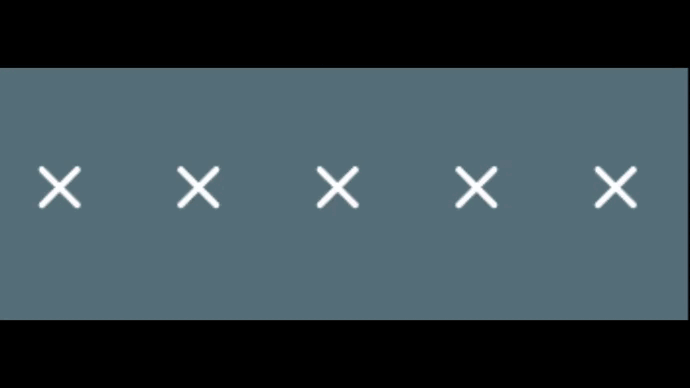

<!--
This README describes the package. If you publish this package to pub.dev,
this README's contents appear on the landing page for your package.

For information about how to write a good package README, see the guide for
[writing package pages](https://dart.dev/guides/libraries/writing-package-pages).

For general information about developing packages, see the Dart guide for
[creating packages](https://dart.dev/guides/libraries/create-library-packages)
and the Flutter guide for
[developing packages and plugins](https://flutter.dev/developing-packages).
-->

A simple animated rating bar to help you implement a rating system in your app.

## Features

* Change between 5 types of animation (bounce, shake, bounceDiagonally, rotate and none).
* Adjust the intensity of the animations.
* Use any widget as rating indicator.
* Supports ratings from 1 to 5.
* Select a rating by swiping or tapping.
* Includes a toggleable Cascade-Animation.

## Usage

1. Declare an `AnimatedRatingBar` with the desired parameters. Ensure the `rowHeight` parameter matches the height of your rating widget.

```dart
    AnimatedRatingBar(
        animationType: ARBAnimationType.rotate,
        rowHeight: 50,
        emptyWidget: Icon(
          Icons.star_border_rounded,
          size: 48,
          color: Colors.white,
        ),
        fullWidget: Icon(
          Icons.star_rounded,
          size: 48,
          color: Colors.white,
        ),
    ),
```
 


2. Use the shake animation:

 

3. Or the bounce animation:



4. Explore other parameters to customize your rating bar, including animation intensity and rating widget selection. You can retrieve the current rating value using the onRatingChanged callback method.

```dart
    AnimatedRatingBar(
        animationType: ARBAnimationType.rotate,
        rowHeight: 50,
        emptyWidget: Icon(
          Icons.star_border_rounded,
          size: 48,
          color: Colors.white,
        ),
        fullWidget: Icon(
          Icons.star_rounded,
          size: 48,
          color: Colors.white,
        ),
        //here
        onRatingChanged: (value) {
            int rating = value;
        },
    ),
```


## Additional information

Feel free to submit pull requests or suggest changes on issues (on GitHub). A simple example is available on the GitHub repository.
